# CollegiumAI Complete System Architecture

```mermaid
graph TB
    %% External Interfaces
    subgraph EXT ["🌐 External Interfaces"]
        USER["👤 Users<br/>Students, Faculty, Admin"]
        BROWSER["🌍 Web Browser<br/>React/Vue Frontend"]
        API_CLIENT["📱 API Clients<br/>Mobile/Desktop Apps"]
        EXTERNAL_LLM["🤖 External LLM Providers<br/>OpenAI, Anthropic, Google"]
        BLOCKCHAIN["⛓️ Blockchain Networks<br/>Ethereum, Polygon"]
    end

    %% Load Balancer & Gateway
    subgraph GATEWAY ["🚪 Gateway Layer"]
        NGINX["🔀 Nginx Reverse Proxy<br/>Load Balancing<br/>SSL Termination"]
        RATE_LIMITER["⚡ Rate Limiting<br/>SlowAPI<br/>60 req/min default"]
    end

    %% API Layer
    subgraph API ["🌐 API Layer"]
        FASTAPI["🚀 FastAPI Server<br/>Port 8080<br/>Async REST API"]
        WS_SERVER["📡 WebSocket Server<br/>Real-time Communication"]
        AUTH["🔐 JWT Authentication<br/>Bearer Token Validation"]
        CORS["🌍 CORS Middleware<br/>Cross-Origin Support"]
    end

    %% Core Framework
    subgraph CORE ["🧠 CollegiumAI Core Framework"]
        UNIVERSITY_FW["🏫 University Framework<br/>Institution Management"]
        GOVERNANCE["📋 Governance Framework<br/>Compliance & Policies"]
        CONTEXT_MGR["📊 Context Manager<br/>Session & State Management"]
    end

    %% Cognitive Architecture
    subgraph COGNITIVE ["🤖 Cognitive Architecture"]
        PERSONA_FACTORY["🎭 Persona Factory<br/>Dynamic Persona Creation"]
        
        subgraph PERSONAS ["🎭 AI Personas"]
            STUDENT_AI["👨‍🎓 Student Assistant<br/>Peer Support & Guidance"]
            TUTOR_AI["👨‍🏫 Tutor AI<br/>Personalized Learning"]
            RESEARCH_AI["🔬 Research Assistant<br/>Academic Analysis"]
            CREATIVE_AI["🎨 Creative AI<br/>Innovation & Problem Solving"]
            ADMIN_AI["👔 Admin Assistant<br/>Administrative Tasks"]
            ADVISOR_AI["🎯 Academic Advisor<br/>Career Guidance"]
        end

        COGNITIVE_ENGINE["🧠 Cognitive Engine<br/>Memory & Reasoning"]
        MEMORY_SYSTEM["🧵 Advanced Memory System<br/>Episodic, Semantic, Procedural"]
    end

    %% Multi-Agent System
    subgraph MULTIAGENT ["🤝 Multi-Agent Coordination"]
        ORCHESTRATOR["🎼 Multi-Agent Orchestrator<br/>Task Distribution & Coordination"]
        AGENT_COMM["📞 Agent Communication<br/>Inter-agent Messaging"]
        TASK_QUEUE["📋 Task Queue<br/>Distributed Task Management"]
        CONSENSUS["🤝 Consensus Engine<br/>Decision Making"]
    end

    %% LLM Integration
    subgraph LLM ["🤖 LLM Integration Layer"]
        LLM_ROUTER["🔀 LLM Router<br/>Provider Selection & Fallback"]
        OLLAMA["🦙 Ollama Local<br/>Llama2, Mistral, CodeLlama"]
        OPENAI_INT["🤖 OpenAI Integration<br/>GPT-4, GPT-3.5-turbo"]
        ANTHROPIC_INT["🧠 Anthropic Integration<br/>Claude-3-sonnet, Claude-3-haiku"]
        GOOGLE_INT["🔍 Google AI Integration<br/>Gemini-pro"]
    end

    %% Database Layer
    subgraph DATABASE ["🗄️ Database Layer"]
        DB_SERVICE["💾 Database Service<br/>Unified Interface"]
        
        subgraph MEMORY ["🏠 In-Memory Stores"]
            MEMORY_STORE["🧵 Memory Store<br/>Cognitive Memories"]
            SESSION_STORE["🔄 Session Store<br/>User Sessions & Context"]
            CACHE_STORE["⚡ Cache Store<br/>High-speed Data Access"]
            ANALYTICS_STORE["📊 Analytics Store<br/>Interaction Logs"]
        end
        
        subgraph DOCKER_DB ["🐳 Docker Databases"]
            POSTGRES["🐘 PostgreSQL<br/>Persistent Data Storage"]
            REDIS["🔴 Redis<br/>Caching & Pub/Sub"]
            MONGODB["🍃 MongoDB<br/>Document Storage"]
        end
    end

    %% Processing Layer
    subgraph PROCESSING ["⚙️ Processing Layer"]
        NLP_PROCESSOR["📝 NLP Processor<br/>Text Analysis & Generation"]
        SENTIMENT_ANALYZER["😊 Sentiment Analyzer<br/>Emotion Detection"]
        INTENT_CLASSIFIER["🎯 Intent Classifier<br/>Request Understanding"]
        RESPONSE_GENERATOR["💬 Response Generator<br/>Context-aware Responses"]
    end

    %% Monitoring & Analytics
    subgraph MONITORING_SYS ["📊 Monitoring & Analytics"]
        MONITORING["📈 Monitoring Service<br/>Real-time Performance"]
        HEALTH_CHECK["🏥 Health Checker<br/>System Status Monitoring"]
        METRICS["📊 Metrics Collector<br/>Performance Analytics"]
        ALERTS["🚨 Alert Manager<br/>Issue Notification"]
        PROMETHEUS["📊 Prometheus<br/>Metrics Storage"]
        GRAFANA["📈 Grafana<br/>Visualization Dashboard"]
    end

    %% Security Layer
    subgraph SECURITY ["🔒 Security Layer"]
        ENCRYPTION["🔐 Encryption<br/>Data Protection"]
        AUDIT_LOG["📝 Audit Logger<br/>Security Event Tracking"]
        PERMISSION["👮 Permission Manager<br/>Role-based Access Control"]
        SECURITY_SCANNER["🔍 Security Scanner<br/>Vulnerability Detection"]
    end

    %% Infrastructure
    subgraph INFRA ["🏗️ Infrastructure Layer"]
        DOCKER["🐳 Docker Containers<br/>Service Containerization"]
        COMPOSE["🐙 Docker Compose<br/>Multi-service Orchestration"]
        VOLUMES["💽 Docker Volumes<br/>Persistent Storage"]
        NETWORKS["🌐 Docker Networks<br/>Service Communication"]
    end

    %% Configuration Management
    subgraph CONFIG ["⚙️ Configuration Management"]
        ENV_CONFIG["📋 Environment Config<br/>.env, .env.production"]
        LLM_CONFIG["🤖 LLM Config<br/>Provider Settings"]
        API_CONFIG["🌐 API Config<br/>Server Configuration"]
        DB_CONFIG["🗄️ Database Config<br/>Connection Settings"]
    end

    %% Connections - External to Gateway
    USER --> BROWSER
    USER --> API_CLIENT
    BROWSER --> NGINX
    API_CLIENT --> NGINX
    NGINX --> RATE_LIMITER
    RATE_LIMITER --> FASTAPI

    %% Connections - API Layer
    FASTAPI --> AUTH
    FASTAPI --> CORS
    FASTAPI --> WS_SERVER
    AUTH --> UNIVERSITY_FW

    %% Connections - Core Framework
    UNIVERSITY_FW --> GOVERNANCE
    UNIVERSITY_FW --> CONTEXT_MGR
    CONTEXT_MGR --> PERSONA_FACTORY

    %% Connections - Cognitive Architecture
    PERSONA_FACTORY --> STUDENT_AI
    PERSONA_FACTORY --> TUTOR_AI
    PERSONA_FACTORY --> RESEARCH_AI
    PERSONA_FACTORY --> CREATIVE_AI
    PERSONA_FACTORY --> ADMIN_AI
    PERSONA_FACTORY --> ADVISOR_AI

    STUDENT_AI --> COGNITIVE_ENGINE
    TUTOR_AI --> COGNITIVE_ENGINE
    RESEARCH_AI --> COGNITIVE_ENGINE
    CREATIVE_AI --> COGNITIVE_ENGINE
    ADMIN_AI --> COGNITIVE_ENGINE
    ADVISOR_AI --> COGNITIVE_ENGINE

    COGNITIVE_ENGINE --> MEMORY_SYSTEM
    COGNITIVE_ENGINE --> ORCHESTRATOR

    %% Connections - Multi-Agent System
    ORCHESTRATOR --> AGENT_COMM
    ORCHESTRATOR --> TASK_QUEUE
    ORCHESTRATOR --> CONSENSUS

    %% Connections - LLM Integration
    COGNITIVE_ENGINE --> LLM_ROUTER
    LLM_ROUTER --> OLLAMA
    LLM_ROUTER --> OPENAI_INT
    LLM_ROUTER --> ANTHROPIC_INT
    LLM_ROUTER --> GOOGLE_INT

    OPENAI_INT --> EXTERNAL_LLM
    ANTHROPIC_INT --> EXTERNAL_LLM
    GOOGLE_INT --> EXTERNAL_LLM

    %% Connections - Database Layer
    MEMORY_SYSTEM --> DB_SERVICE
    CONTEXT_MGR --> DB_SERVICE
    ORCHESTRATOR --> DB_SERVICE

    DB_SERVICE --> MEMORY_STORE
    DB_SERVICE --> SESSION_STORE
    DB_SERVICE --> CACHE_STORE
    DB_SERVICE --> ANALYTICS_STORE

    DB_SERVICE --> POSTGRES
    DB_SERVICE --> REDIS
    DB_SERVICE --> MONGODB

    %% Connections - Processing Layer
    COGNITIVE_ENGINE --> NLP_PROCESSOR
    NLP_PROCESSOR --> SENTIMENT_ANALYZER
    NLP_PROCESSOR --> INTENT_CLASSIFIER
    NLP_PROCESSOR --> RESPONSE_GENERATOR

    %% Connections - Monitoring
    FASTAPI --> MONITORING
    DB_SERVICE --> MONITORING
    COGNITIVE_ENGINE --> MONITORING
    ORCHESTRATOR --> MONITORING

    MONITORING --> HEALTH_CHECK
    MONITORING --> METRICS
    MONITORING --> ALERTS
    METRICS --> PROMETHEUS
    PROMETHEUS --> GRAFANA

    %% Connections - Security
    AUTH --> ENCRYPTION
    FASTAPI --> AUDIT_LOG
    UNIVERSITY_FW --> PERMISSION
    NGINX --> SECURITY_SCANNER

    %% Connections - Infrastructure
    FASTAPI -.-> DOCKER
    POSTGRES -.-> DOCKER
    REDIS -.-> DOCKER
    MONGODB -.-> DOCKER
    NGINX -.-> DOCKER

    DOCKER --> COMPOSE
    COMPOSE --> VOLUMES
    COMPOSE --> NETWORKS

    %% Connections - Configuration
    FASTAPI --> ENV_CONFIG
    LLM_ROUTER --> LLM_CONFIG
    FASTAPI --> API_CONFIG
    DB_SERVICE --> DB_CONFIG

    %% Blockchain Integration
    GOVERNANCE --> BLOCKCHAIN

    %% Styling
    classDef userInterface fill:#e1f5fe,stroke:#01579b,stroke-width:2px
    classDef apiLayer fill:#f3e5f5,stroke:#4a148c,stroke-width:2px
    classDef cognitiveLayer fill:#e8f5e8,stroke:#1b5e20,stroke-width:2px
    classDef dataLayer fill:#fff3e0,stroke:#e65100,stroke-width:2px
    classDef infrastructureLayer fill:#fce4ec,stroke:#880e4f,stroke-width:2px
    classDef securityLayer fill:#ffebee,stroke:#b71c1c,stroke-width:2px

    class USER,BROWSER,API_CLIENT userInterface
    class FASTAPI,WS_SERVER,AUTH,CORS apiLayer
    class PERSONA_FACTORY,STUDENT_AI,TUTOR_AI,RESEARCH_AI,CREATIVE_AI,ADMIN_AI,ADVISOR_AI,COGNITIVE_ENGINE,MEMORY_SYSTEM,ORCHESTRATOR cognitiveLayer
    class DB_SERVICE,MEMORY_STORE,SESSION_STORE,CACHE_STORE,ANALYTICS_STORE,POSTGRES,REDIS,MONGODB dataLayer
    class DOCKER,COMPOSE,VOLUMES,NETWORKS infrastructureLayer
    class ENCRYPTION,AUDIT_LOG,PERMISSION,SECURITY_SCANNER securityLayer
```

## 🏗️ Architecture Components Overview

### 🌐 **External Interfaces**
- **Users**: Students, faculty, administrators, researchers
- **Frontends**: Web browsers, mobile/desktop applications
- **External Services**: LLM providers, blockchain networks

### 🚪 **Gateway Layer**
- **Nginx**: Reverse proxy, load balancing, SSL termination
- **Rate Limiting**: Request throttling and protection

### 🌐 **API Layer**
- **FastAPI**: High-performance async REST API server
- **WebSocket**: Real-time communication support
- **Authentication**: JWT-based security
- **CORS**: Cross-origin resource sharing

### 🧠 **Cognitive Architecture**
- **Multi-Persona System**: 6 specialized AI personas
- **Cognitive Engine**: Central reasoning and memory processing
- **Advanced Memory**: Episodic, semantic, and procedural memory types
- **Multi-Agent Coordination**: Distributed task processing

### 🤖 **LLM Integration**
- **Smart Routing**: Automatic provider selection and fallback
- **Local Support**: Ollama for offline operation
- **Cloud Providers**: OpenAI, Anthropic, Google AI integration

### 🗄️ **Database Layer**
- **Hybrid Architecture**: In-memory + persistent storage
- **Docker Services**: PostgreSQL, Redis, MongoDB
- **Specialized Stores**: Memory, session, cache, analytics

### 📊 **Monitoring & Analytics**
- **Real-time Monitoring**: Performance and health tracking
- **Metrics Collection**: Comprehensive system analytics
- **Visualization**: Prometheus + Grafana dashboards

### 🔒 **Security Layer**
- **Multi-layered Security**: Encryption, audit logging, RBAC
- **Vulnerability Scanning**: Automated security checks

### 🏗️ **Infrastructure**
- **Containerization**: Docker-based deployment
- **Orchestration**: Docker Compose for multi-service management
- **Configuration**: Environment-based settings management

This architecture supports:
- ✅ **High Availability** with load balancing and fallback systems
- ✅ **Scalability** through containerization and microservices
- ✅ **Security** with multi-layered protection
- ✅ **Performance** via caching and async processing
- ✅ **Flexibility** with modular cognitive personas
- ✅ **Monitoring** for operational excellence