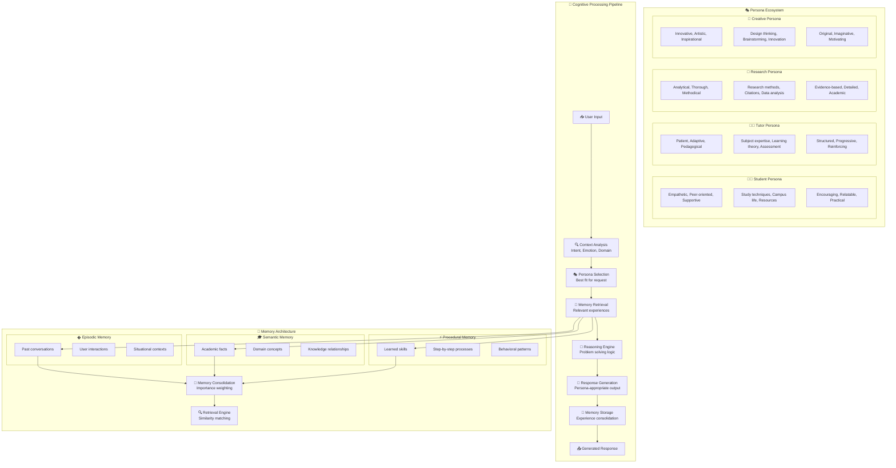
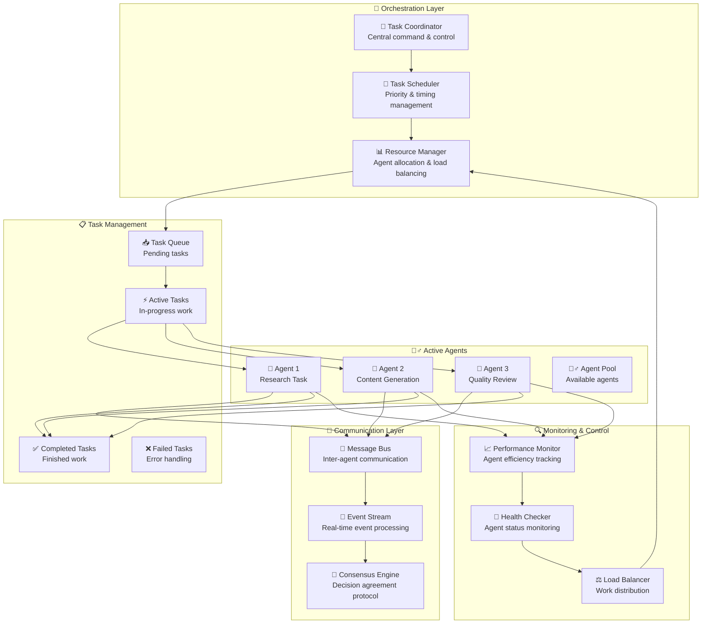
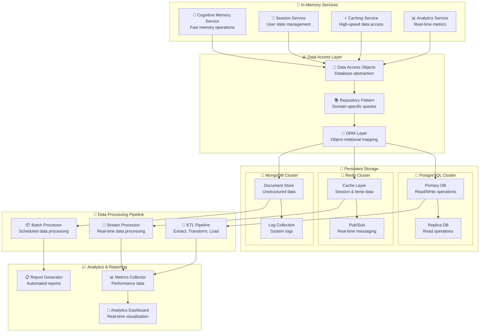
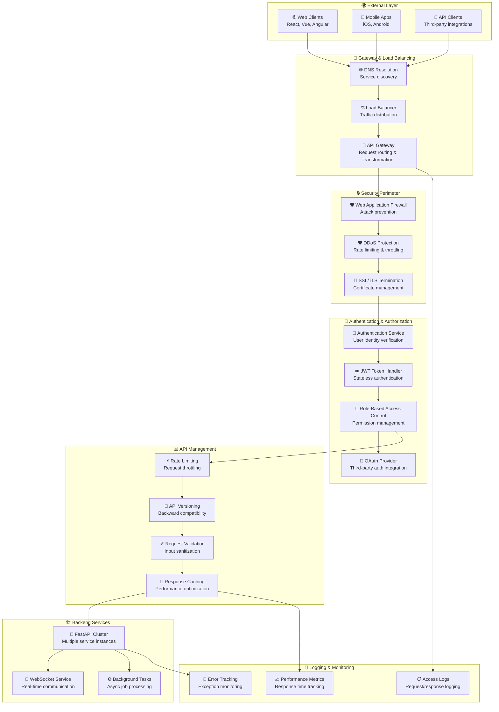

# CollegiumAI Detailed Subsystem Architectures

## 🧠 Cognitive Architecture Deep Dive

## 🤝 Multi-Agent Coordination System

## 🗄️ Database Architecture & Data Flow

## 🌐 API Gateway & Security Architecture

## 🔄 Deployment & DevOps Pipeline

```mermaid
graph LR
    subgraph DEVELOPMENT ["💻 Development"]
        DEV_ENV[👨‍💻 Developer<br/>Local environment]
        GIT_REPO[📁 Git Repository<br/>Source code management]
        FEATURE_BRANCH[🌿 Feature Branch<br/>Development isolation]
    end

    subgraph QA ["🔍 Quality Assurance"]
        UNIT_TESTS[🧪 Unit Tests<br/>Code validation]
        INTEGRATION_TESTS[🔗 Integration Tests<br/>Component interaction]
        SECURITY_SCAN[🔒 Security Scanning<br/>Vulnerability detection]
        CODE_REVIEW[👥 Code Review<br/>Peer validation]
    end

    subgraph BUILD ["🏗️ Build & Package"]
        CI_PIPELINE[⚙️ CI Pipeline<br/>Automated build]
        DOCKER_BUILD[🐳 Docker Build<br/>Container creation]
        IMAGE_REGISTRY[📦 Container Registry<br/>Image storage]
        HELM_CHARTS[⛵ Helm Charts<br/>Kubernetes deployment]
    end

    subgraph DEPLOYMENT ["🚀 Deployment Environments"]
        STAGING[🎭 Staging Environment<br/>Pre-production testing]
        PRODUCTION[🏭 Production Environment<br/>Live system]
        MONITORING[📊 Monitoring<br/>Health & performance]
    end

    subgraph OPERATIONS ["🔄 Operations"]
        LOG_AGGREGATION[📝 Log Aggregation<br/>Centralized logging]
        ALERTING[🚨 Alerting<br/>Issue notification]
        BACKUP[💾 Backup<br/>Data protection]
        SCALING[📈 Auto-scaling<br/>Dynamic resource adjustment]
    end

    %% Development Flow
    DEV_ENV --> GIT_REPO
    GIT_REPO --> FEATURE_BRANCH
    FEATURE_BRANCH --> UNIT_TESTS

    %% Quality Flow
    UNIT_TESTS --> INTEGRATION_TESTS
    INTEGRATION_TESTS --> SECURITY_SCAN
    SECURITY_SCAN --> CODE_REVIEW

    %% Build Flow
    CODE_REVIEW --> CI_PIPELINE
    CI_PIPELINE --> DOCKER_BUILD
    DOCKER_BUILD --> IMAGE_REGISTRY
    IMAGE_REGISTRY --> HELM_CHARTS

    %% Deployment Flow
    HELM_CHARTS --> STAGING
    STAGING --> PRODUCTION
    PRODUCTION --> MONITORING

    %% Operations Flow
    MONITORING --> LOG_AGGREGATION
    LOG_AGGREGATION --> ALERTING
    ALERTING --> BACKUP
    BACKUP --> SCALING
    SCALING --> MONITORING
```

This comprehensive architecture documentation shows:

1. **🧠 Cognitive Architecture**: Deep dive into AI persona system and memory management
2. **🤝 Multi-Agent Coordination**: Distributed task processing and agent communication
3. **🗄️ Database Architecture**: Hybrid storage with in-memory and persistent layers
4. **🌐 API Security**: Complete gateway, authentication, and protection systems
5. **🔄 DevOps Pipeline**: Full deployment and operational workflow

Each subsystem is designed for:
- ✅ **High Performance** with caching and async processing
- ✅ **Scalability** through containerization and load balancing
- ✅ **Security** with multi-layered protection
- ✅ **Reliability** via monitoring and health checks
- ✅ **Maintainability** through modular architecture